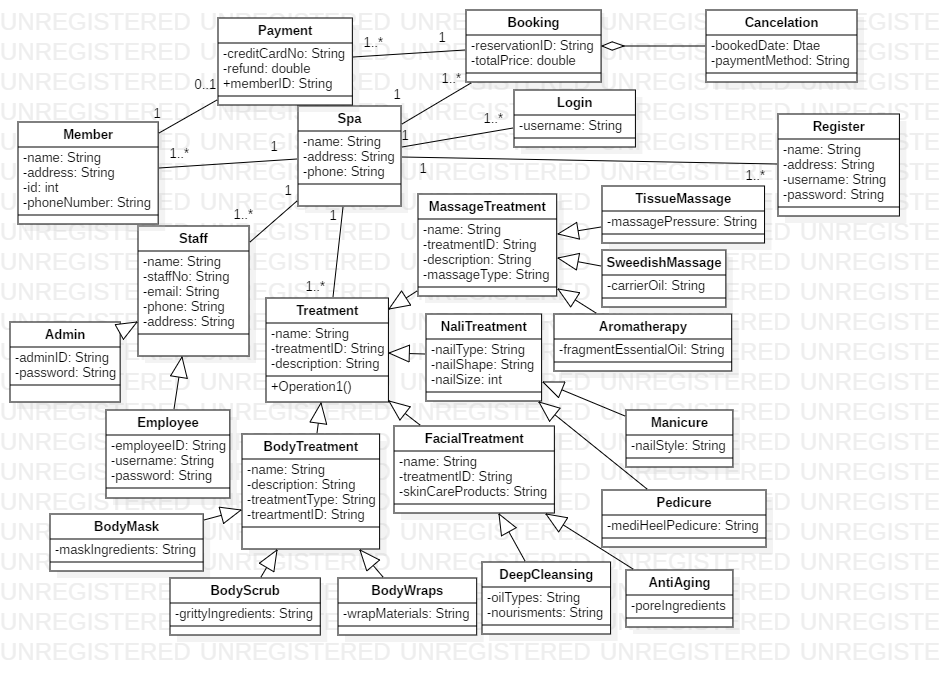

# domainProject6
##Problem Domain: Spa management system
Sub-domain: Booking and Reservations of spa Treatments, 
the system will basically concentrate on the booking of a spa treatment and also make reservations. 
The system will allow a user to sign in, if the member is new, he/she will have to register by providing the users name, 
address and phone number. Once the user has signed in as a member, he or she can now book or make reservation for the spa treatment day. 
The member will now pick a date of treatment, the treatment the member wasn’t ans specify the number of guests that should be expected.

